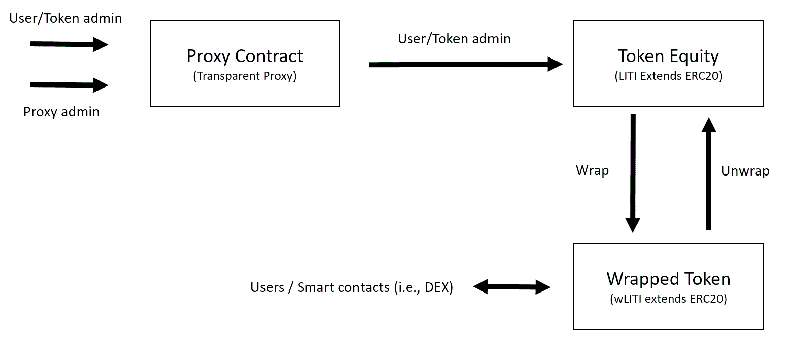

# Liti Capital digitalized Shares (LITI) and Wrapped Token (wLITI)

Liti Capital SA is a Swiss investment company that combines blockchain-based solutions, advanced data analytics and investigative capabilities to conduct litigation funding. Liti Capital SA can capitalize on its network of pre-existing relationships with banks and financial institutions to obtain preferential access to valid cases.

This repository contains the smart contract code for the smart contracts used to represent digitalized shares of the company and a wrapped token that is exchangeable one-to-one with Liti Capital shares previous fulfilment of Liti Capital terms of conditions (i.e. AML, KYC, etc. see http:www.liticapital.com for more details).

LITI smart contract is upgradeable and “owned” (there is an admin in the system) in order to be compliant with current and future regulation requests, and also provide functionalities that, for instance, aim to protect users from losing access to their token. wLITI (the wrapped token smart contract) is not upgradeable and it is not “owned”. Both contracts are extensions of the ERC20 standard.

Figure 1 shows the general diagram of the system.	
||
|:--:|
|*Figure 1*: General diagram of the system|

